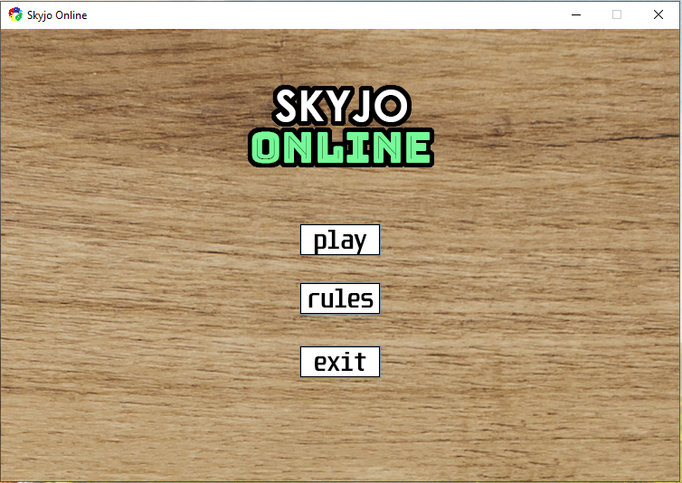
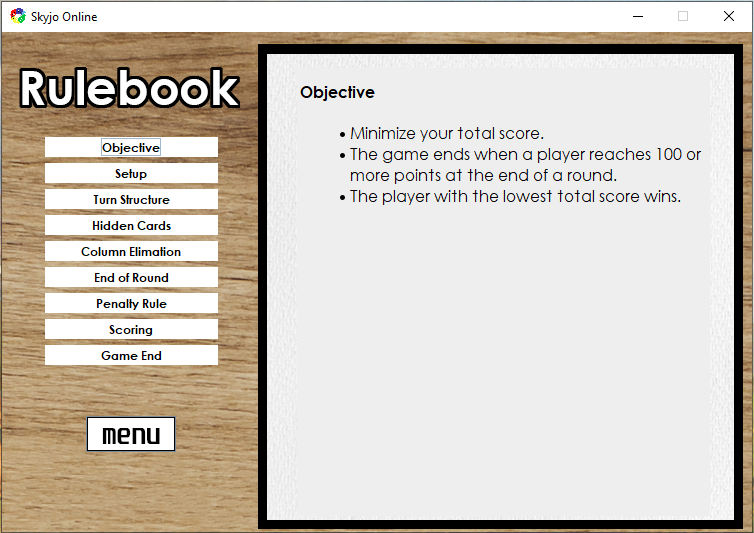
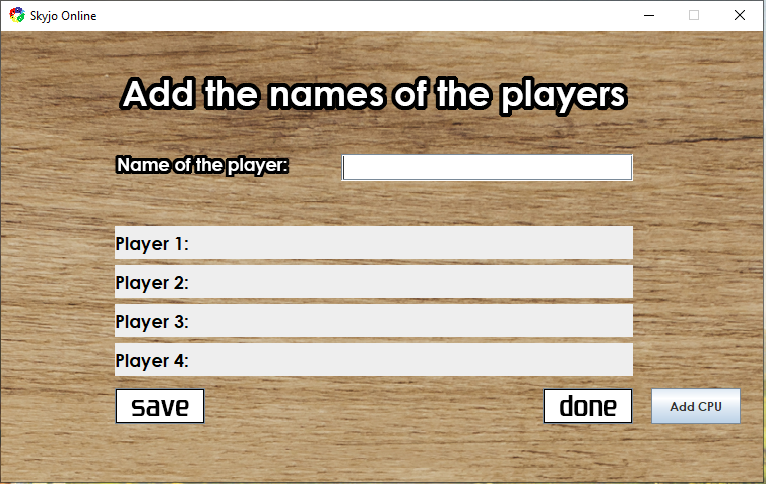
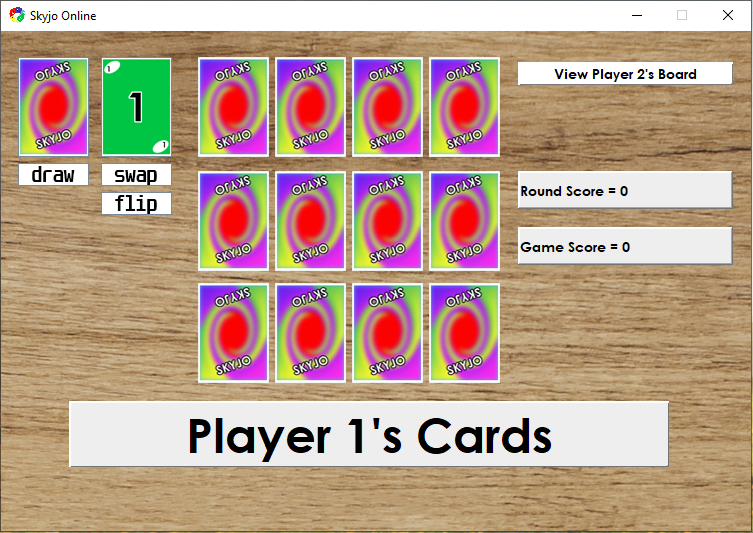
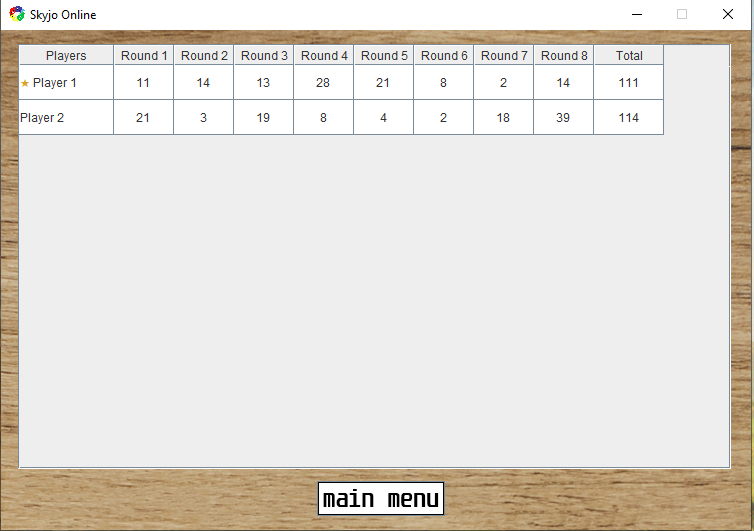

# Skyjo Online
A Java implementation of the card game Skyjo, featuring a graphical user interface built with Java Swing.

## Features
- Complete Skyjo gameplay implemented in Java
- GUI built with Java Swing
- Custom art for buttons, cards, logos and images
- 3 x 4 card grid for each player
- Player turns with card drawing, discarding, swapping and flipping
- Ability to view opponent boards during your turn
- Automatic card revealing, clearing and board updates
- Score tracking and end-of-game scoreboard
- Discard and draw deck management
- Comprehensive rulebook divided into topics
- Maven-based project structure

## Gameplay
Skyjo is a card game where players attempt to achieve the lowest score possible.

Each player begins with a 3 x 4 grid of cards. During a turn, a player can draw from the deck or take the top card from the discard pile. The drawn card can then be used to replace a card in the player's grid. The player can also disregard the drawn card and flip a non-revealed card in their grid.

## Technologies
- Java
- Java Swing
- Maven
- NetBeans

## Getting Started
Download the latest release [here](https://github.com/gregoryvm/Skyjo-Online/releases/tag/v1.0.0).

Instructions for downloading and running the game are included with every release.

## Screenshots

## Future Updates
- **CPU players** - In Progess
- Online multiplayer
- Options for different card art & board backgrounds
- Improved UI animations and transitions
- Leaderboard and persistent player stats

## License
This project is intended as a personal software development project and portfolio piece.
